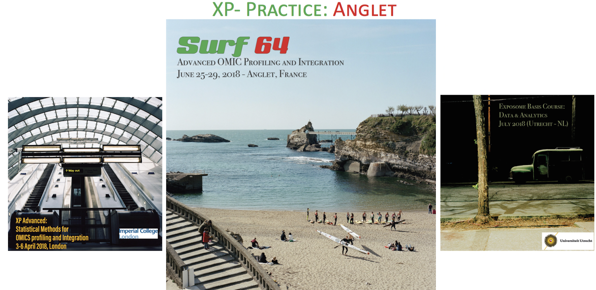
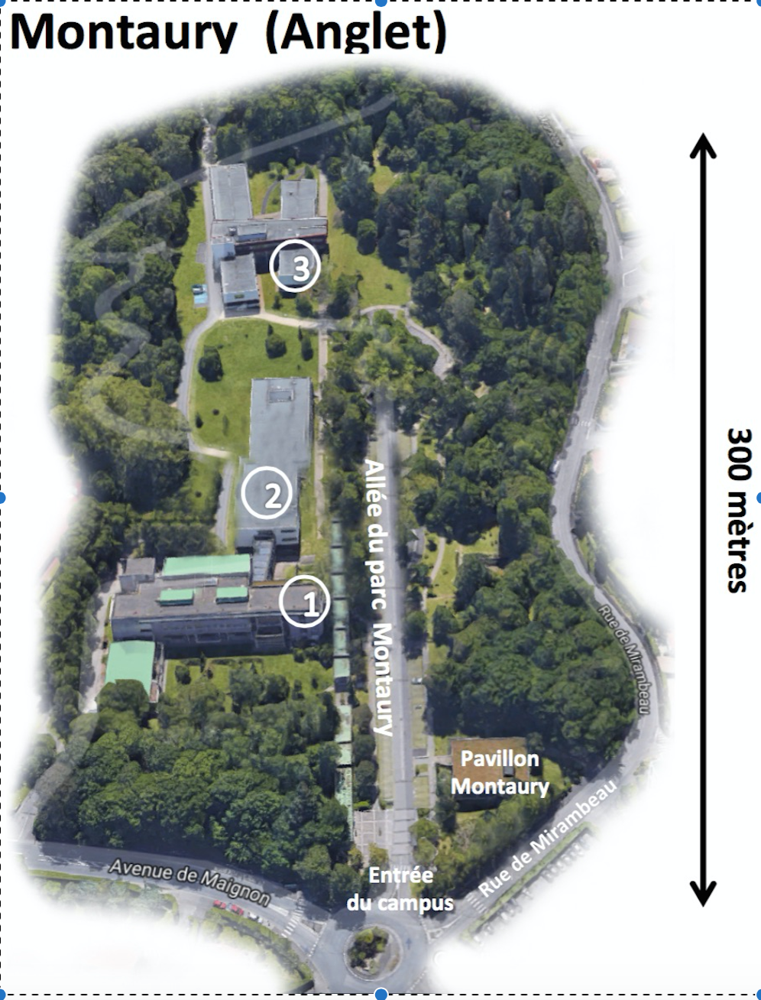

# XP-Practice: ANGLET workshop (25 to 29 June 2018)
Advanced OMIC Profiling and Integration

Welcome to the first summer school organized in Anglet. 

## Week Schedule

- The week schedule is available 
[here](IMAGES/Week_schedule.pdf)

    - Monday Lectures are available [here](Monday/README.md)

- The Full program is available [here](IMAGES/Full_Surf64_brochure_final.pdf)

## Practical Information

- Welcome and registration is between 9.15 to 9.30.
- Location:  the first floor of building 1 (see map) close to room 109. 
- First lecture starts at 9.30 in room 109.

You can find some useful information  [here](Information.md)

## Set up your computer 

Please find some instructions to set up your computer before the start of the summer school ([here](Setup.md))

